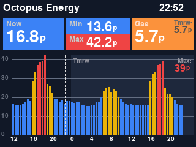

# Octopus Agile Mini Dashboard

A compact Raspberry Pi dashboard that displays real-time Octopus Energy Agile electricity prices on a ST7789 display with color-coded price indicators.



## Features

- 📊 Real-time Agile electricity pricing with 24-hour chart
- ⚡ Tomorrow's full 24-hour prices shown when available (usually after 4pm)
- 💰 Gas tracker pricing included (today + tomorrow when available)
- 🌤️ Weather display
- 🎨 Color-coded price indicators (green/blue/yellow/red based on configurable thresholds)
- 💾 Smart daily price caching with auto-cleanup
- 🔄 Systemd service with automatic startup and restart
- 🚀 One-command Ansible deployment

## Hardware Requirements

- Raspberry Pi Zero W (or any Raspberry Pi) with fresh Raspberry Pi OS and SSH enabled
- [Pimoroni Display HAT Mini](https://shop.pimoroni.com/products/display-hat-mini) (ST7789, 320x240, SPI)
- Octopus Energy Agile electricity & Gas tracker tariffs

## Quick Start

### 1. Prerequisites

On your control machine (not the Pi):
```bash
# Install Ansible
pip install ansible

# Ensure Pi is accessible
ping pizero.local
```

### 2. Configure

Edit `group_vars/all.yml`:
```yaml
# Set your Octopus region (A-P)
octopus_region: "C"  # e.g., C for London

# Update product codes if needed
agile_product: "AGILE-24-10-01"
gas_product: "SILVER-25-09-02"

# Display rotation (0, 90, 180, or 270 degrees)
display_rotation: 0

# Weather location (get from Google Maps or similar)
weather_latitude: 51.5074   # Your latitude
weather_longitude: -0.1278  # Your longitude

# Adjust price color thresholds (pence)
price_thresholds:
  cheap: 10      # Under this = green
  moderate: 20   # Under this = blue
  expensive: 35  # Under this = yellow, over = red
```

Edit `inventory.ini` with your Pi hostname:
```ini
[pizero]
pizero.local ansible_user=luke
```

### 3. Deploy

```bash
./deploy.sh
```

That's it! The dashboard will start automatically and run on boot.

## What It Does

The deployment script:
1. ✅ Installs system dependencies (Python, SPI drivers, fonts)
2. ✅ Enables SPI interface
3. ✅ Deploys dashboard code
4. ✅ Installs Python packages (Pillow, requests, st7789)
5. ✅ Creates systemd service
6. ✅ Starts dashboard automatically

## Price Colors

- **Green**: Cheap (< 10p/kWh)
- **Blue**: Moderate (10-20p/kWh)
- **Yellow**: Expensive (20-35p/kWh)
- **Red**: Very expensive (> 35p/kWh)
- **Orange**: Gas price (always)

## Tomorrow's Prices

When tomorrow's prices become available (usually after 4pm):
- Chart shows full 24 hours of tomorrow's prices
- Tomorrow section has darker background
- Shows tomorrow's gas price and max electricity price
- Midnight (0) label marks the day boundary

## Management

### Check Status
```bash
ansible pizero -m shell -a "systemctl status agile-dashboard"
```

### View Logs
```bash
ansible pizero -m shell -a "journalctl -u agile-dashboard -f"
```

### Restart Service
```bash
ansible pizero -m shell -a "sudo systemctl restart agile-dashboard"
```

### Update Configuration
1. Edit `group_vars/all.yml`
2. Run `./deploy.sh`
3. Service automatically restarts with new settings

## Local Testing

Test the dashboard without Pi hardware:
```bash
python dashboard-snap.py
```

Generates `dashboard-TIMESTAMP.png` for preview.

## API Information

Uses public API endpoints - **no API key required**:
- **Octopus Energy API**: Agile electricity and gas tracker rates
- **Open-Meteo API**: Weather forecasts (free, no registration needed)
- Data cached locally to minimize API calls
- Old cache files automatically cleaned up

## Troubleshooting

**Display shows nothing:**
```bash
# Check SPI is enabled
ansible pizero -m shell -a "ls /dev/spidev*"

# If missing, reboot after deployment
ansible pizero -m shell -a "sudo reboot"
```

**No price data:**
```bash
# Check logs for API errors
ansible pizero -m shell -a "journalctl -u agile-dashboard -n 50"

# Verify internet connection
ansible pizero -m shell -a "ping -c 3 api.octopus.energy"
```

**Service won't start:**
```bash
# Check Python dependencies
ansible pizero -m shell -a "pip3 list | grep -E '(Pillow|requests|st7789)'"

# Check file permissions
ansible pizero -m shell -a "ls -la /home/luke/agile-dashboard/"
```

## Project Structure

```
.
├── ansible.cfg              # Ansible configuration
├── inventory.ini            # Pi hostname/connection
├── group_vars/
│   └── all.yml             # All configuration variables
├── deploy.yml              # Main Ansible playbook
├── templates/
│   ├── dashboard.py.j2     # Main dashboard script template
│   ├── dashboard-snap.py.j2# Testing script template
│   └── dashboard.service.j2# Systemd service template
├── deploy.sh               # One-click deployment script
├── check.sh                # Status check script
├── dashboard-snap.py       # Local testing script
├── requirements.txt        # Python dependencies
└── README.md              # This file
```

## Files Created on Pi

```
/home/luke/agile-dashboard/
├── dashboard.py            # Main dashboard script
├── dashboard-snap.py       # Testing script
├── requirements.txt        # Python dependencies
└── price-data-YYYY-MM-DD.json  # Daily price cache (auto-cleaned)

/etc/systemd/system/
└── agile-dashboard.service # Systemd service
```

## Configuration Reference

All settings in `group_vars/all.yml`:

| Variable | Default | Description |
|----------|---------|-------------|
| `octopus_region` | C | Your Octopus region code (A-P) |
| `agile_product` | AGILE-24-10-01 | Agile tariff product code |
| `gas_product` | SILVER-25-09-02 | Gas tracker product code |
| `display_width` | 320 | Display width in pixels |
| `display_height` | 240 | Display height in pixels |
| `display_rotation` | 180 | Display rotation (0/90/180/270) |
| `price_thresholds.cheap` | 10 | Green threshold (pence/kWh) |
| `price_thresholds.moderate` | 20 | Blue threshold (pence/kWh) |
| `price_thresholds.expensive` | 35 | Yellow threshold (pence/kWh) |
| `update_interval` | 300 | API fetch interval (seconds) |
| `redraw_interval` | 30 | Display refresh interval (seconds) |
| `weather_latitude` | 51.5074 | Location latitude for weather |
| `weather_longitude` | -0.1278 | Location longitude for weather |
| `dashboard_dir` | /home/luke/agile-dashboard | Installation directory |
| `dashboard_user` | luke | User to run service as |

## License

MIT

## Acknowledgments

- [Octopus Energy API](https://developer.octopus.energy/docs/api/)
- [Pimoroni Display HAT Mini](https://github.com/pimoroni/displayhatmini-python)
